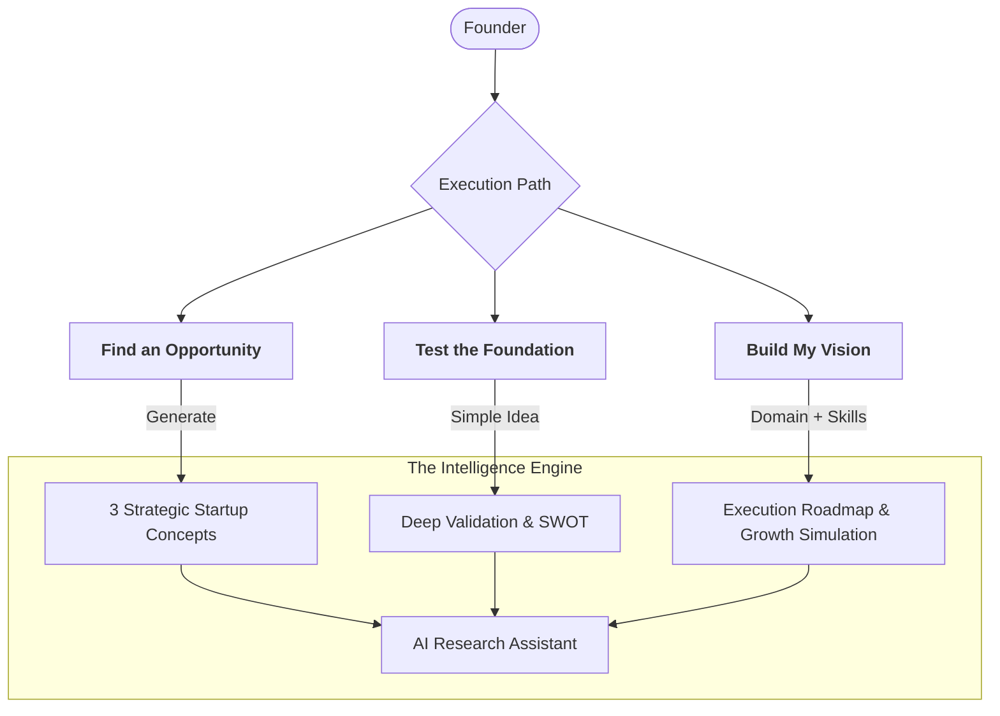
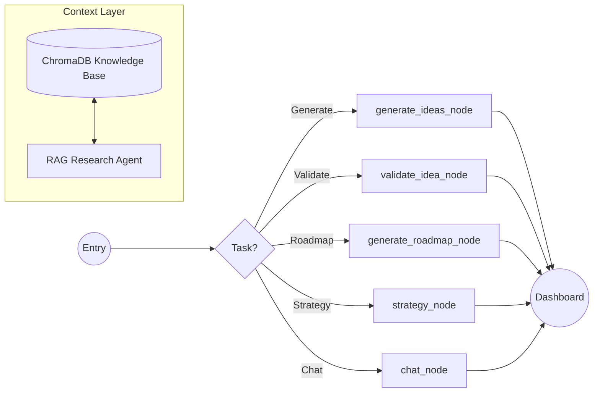

# 🚀 Startup Copilot AI: Platform Infographic

Our platform has evolved into a high-octane startup command center. Here is how the engine works.

## 🗺️ The User Journey (Three Strategic Paths)

## 🧠 The Agentic Graph (LangGraph Architecture)

## 🛠️ The Technology Stack

| Layer | Technology | Purpose |
| :--- | :--- | :--- |
| **Backend** | **FastAPI** | High-performance API orchestration |
| **AI Graph** | **LangGraph** | State-managed agent workflows |
| **Brain** | **Llama 3.1 (Groq)** | 8B parameter high-speed inference |
| **Memory** | **ChromaDB** | Semantic search & RAG Knowledge Base |
| **Frontend** | **Vanilla JS / CSS** | Premium Glassmorphism UI |

---

### 🌟 Key Performance Features
- **Deterministic State**: LangGraph ensures the AI never loses context during the session.
- **RAG-Powered**: Research answers are grounded in a curated knowledge base of startup wisdom.
- **Strategic Intelligence**: Strategy is dynamically calculated based on **Founder Age** (Risk) and **Budget** (Runway).
